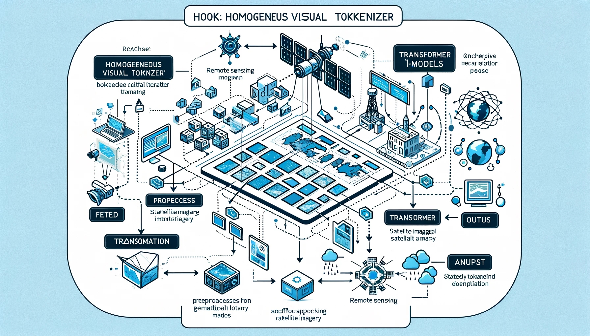

# Homogeneous Tokenizer Matters: Homogeneous Visual Tokenizer for Remote Sensing Image Understanding

<p align="center">
        <a href="https://www.sciencedirect.com/science/article/pii/S0924271624003472">Paper</a>
</p>

<p align="center">
    
<p>

This is the official pytorch implementation of HOOK.

_\* The above conceptual image was generated by DALL-E_

## News

:star2: :star2: :star2: Our paper has been accepted by ISPRS Journal of Photogrammetry and Remote Sensing.

## Abstract
On the basis of the transformer architecture and the pretext task of “next-token prediction”, multimodal large language models (MLLMs) are revolutionizing the paradigm in the field of remote sensing image understanding. However, the tokenizer, as one of the fundamental components of MLLMs, has long been overlooked or even misunderstood in visual tasks. A key factor contributing to the great comprehension power of large language models is that natural language tokenizers utilize meaningful words or subwords as the basic elements of language. In contrast, mainstream visual tokenizers, represented by patch-based methods such as Patch Embed, rely on meaningless rectangular patches as basic elements of vision. Analogous to words or subwords in language, we define semantically independent regions (SIRs) for vision and then propose two properties that an ideal visual tokenizer should possess: (1) homogeneity, where SIRs serve as the basic elements of vision, and (2) adaptivity, which allows for a flexible number of tokens to accommodate images of any size and tasks of any granularity. On this basis, we design a simple HOmogeneous visual tOKenizer: HOOK. HOOK consists of two modules: an object perception module (OPM) and an object vectorization module (OVM). To achieve homogeneity, the OPM splits the image into 4 × 4 pixel seeds and then uses a self-attention mechanism to identify SIRs. The OVM employs cross-attention to merge seeds within the same SIR. To achieve adaptability, the OVM predefines a variable number of learnable vectors as cross-attention queries, allowing for the adjustment of the token quantity. We conducted experiments on the NWPU-RESISC45, WHU-RS19, and NaSC-TG2 classification datasets for sparse tasks and the GID5 and DGLCC segmentation datasets for dense tasks. The results show that the visual tokens obtained by HOOK correspond to individual objects, thereby verifying their homogeneity. Compared with randomly initialized or pretrained Patch Embed, which required more than one hundred tokens per image, HOOK required only 6 and 8 tokens for sparse and dense tasks, respectively, resulting in performance improvements of 2% to 10% and efficiency improvements of 1.5 to 2.8 times. The homogeneity and adaptability of the proposed approach provide new perspectives for the study of visual tokenizers. Guided by these principles, the developed HOOK has the potential to replace traditional Patch Embed.


基于Transformer架构和“预测下一个token”的自监督任务，多模态大语言模型（MLLMs）正在革新遥感图像理解领域的范式。然而，作为MLLMs的基础组成部分之一，tokenizer在视觉任务中长期以来被忽视甚至误解。大语言模型具备强大理解能力的一个关键因素在于，自然语言的tokenizer将有意义的单词或子词作为语言的基本单元。相比之下，以Patch Embed等基于patch的方法为代表的主流视觉tokenizer，依赖于无意义的矩形patch作为视觉的基本单元。

类比于语言中的单词或子词，我们为视觉定义了语义独立区域（Semantically Independent Regions），并提出了理想视觉tokenizer应具备的两个性质：（1）均一性，即SIRs作为视觉的基本元素；（2）适应性，即允许根据图像大小和任务的粒度灵活调整token数量。在此基础上，我们设计了一个简单的均一性视觉tokenizer：HOOK。HOOK由两个模块组成：对象感知模块（Object Perception Module）和对象向量化模块（Object Vectorization Module）。为实现均一性，对象感知模块将图像分割为4 × 4像素的种子区域，然后使用自注意力机制识别SIRs。对象向量化模块使用交叉注意力将同一语义独立区域内的种子区域合并。为实现适应性，对象向量化模块预定义了可变数量的可学习向量作为交叉注意力的查询，从而实现对token数量的调整。

我们在NWPU-RESISC45、WHU-RS19和NaSC-TG2分类数据集（稀疏任务）以及GID5和DGLCC分割数据集（密集任务）上进行了实验。结果表明，HOOK生成的视觉token与图像中的对象一一对应，从而验证了其具备均一性。相比随机初始化或预训练的Patch Embed每张图像需要超过100个token，HOOK在稀疏任务和密集任务中分别仅需要6个和8个token，带来了2%到10%的性能提升以及1.5到2.8倍的效率提升。均一性和适应性为视觉tokenizer研究提供了新的视角。以这些原则为指导，所开发的HOOK有潜力替代传统的Patch Embed。

## Performance
| Datasets | Visual tokenizer | Performance | Log |
| -------- | ---------------- | ----------- | --- |
| NWPU     | Patch Embed      | 70.30       | <a href="assets/logs/NWPU_PE.log">log</a> |
| NWPU     | HOOK             | **77.38**   | <a href="assets/logs/NWPU_HOOK.log">log</a> |
| WHURS19  | Patch Embed      | 78.10       | <a href="assets/logs/RS19_PE.log">log</a> |
| WHURS19  | HOOK             | **87.58**   | <a href="assets/logs/RS19_HOOK.log">log</a> |
| NaSCTG2  | Patch Embed      | 86.56       | <a href="assets/logs/NaSCTG2_PE.log">log</a> |
| NaSCTG2  | HOOK             | **88.25**   | <a href="assets/logs/NaSCTG2_HOOK.log">log</a> |
| GID5     | Patch Embed      | 67.79       | <a href="assets/logs/GID_PE.log">log</a> |
| GID5     | HOOK             | **78.81**   | <a href="assets/logs/GID_HOOK.log">log</a> |
| DGLCC    | Patch Embed      | **54.57**   | <a href="assets/logs/DGLCC_PE.log">log</a> |
| DGLCC    | HOOK             | 54.27       | <a href="assets/logs/DGLCC_HOOK.log">log</a> |

## Installation
### Requirements
- Python 3.8 and above
- pytorch 2.0 and above
- CUDA
### Installing dependencies
1. Create a Virtual Environment

```
conda create -n Hook python=3.8 -y
conda activate Hook
```

2. Install pytorch

```
conda install pytorch==2.0.1 torchvision==0.15.2 torchaudio==2.0.2 pytorch-cuda=11.7 -c pytorch -c nvidia
```

3. Install dependent libraries

```
pip install -r requirements.txt
```

## Datasets
1. download

The datasets we used are publicly available on [Baidu Cloud(code:ep6g)](https://pan.baidu.com/s/1UFkzAKLbs70Ztw_ZyFZvfA?pwd=ep6g) and [Google Cloud](https://drive.google.com/file/d/1N-vQ9Hu6f6PhSpcGN70hJdVJrS_Cbx7v/view?usp=sharing).

2. Prepare datasets

Modify part of the code in the following three files as shown in the example below, and change the path to your own path:

```python
# token_datasets/NWPU_RESISC45.py
@staticmethod
def get_cfg():
    return dict(
        root_path='/media/shaorun/zl/Dataset/HOOK_datasets/NWPU/NWPU-RESISC45',
        metainfo_train='/media/shaorun/zl/Dataset/HOOK_datasets/NWPU/train.csv',
        metainfo_test='/media/shaorun/zl/Dataset/HOOK_datasets/NWPU/test.csv'
    )
```

```python
# token_datasets/WHU_RS19.py
@staticmethod
def get_cfg():
    return dict(
        root_path='/media/shaorun/zl/Dataset/HOOK_datasets/RS19/WHU-RS19',
        metainfo_train='/media/shaorun/zl/Dataset/HOOK_datasets/RS19/train0.5.csv',
        metainfo_test='/media/shaorun/zl/Dataset/HOOK_datasets/RS19/test0.5.csv'
    )
```

```python
# token_datasets/GID.py
@staticmethod
def get_cfg():
    return dict(
        train_imgdir = "/media/shaorun/zl/Dataset/HOOK_datasets/GID/train",
        train_anndir = "/media/shaorun/zl/Dataset/HOOK_datasets/GID/train_labels",
        test_imgdir = "/media/shaorun/zl/Dataset/HOOK_datasets/GID/test",
        test_anndir = "/media/shaorun/zl/Dataset/HOOK_datasets/GID/test_labels",
    )
```

## Training
### HOOK
- Sparse task (Classification)

```
# NWPU_RESISC45
python main_classification.py --exp-name HOOK_NWPU_100e_vis --seed 0 --token-num 6 --vis --dataset NWPU_RESISC45

# WHU-RS19
python main_classification.py --exp-name HOOK_NWPU_100e_vis --seed 0 --token-num 6 --vis --dataset WHURS19
```

- Dense task (Segmentation)

```
# GID
python main_segmentation.py --exp-name HOOK_GID_100e_vis --seed 0 --token-num 8 --vis --dataset GID
```

The meaning of the argument `--vis` is to output visualization results of homogeneous visual tokens during evaluation, removing this parameter will not output.

### Patch Embed
- Sparse task (Classification)

```
# NWPU_RESISC45
python pe_classification.py --exp-name PE_NWPU_100e --seed 0 --dataset NWPU_RESISC45

# WHU-RS19
python pe_classification.py --exp-name PE_WHURS19_100e --seed 0 --dataset WHURS19
```

- Dense task (Segmentation)

```
python pe_segmentation.py --exp-name PE_GID_100e --seed 0 --dataset GID
```

More controllable arguments are shown in the file: "pe_classification.py", "pe_segmentation.py", "main_classification.py" and "main_segmentation.py".

## Citation
If you find our paper and code useful in your research, please consider giving a star and citation :)

```BibTeX
@article{SHAO2024294,
        title = {Homogeneous tokenizer matters: Homogeneous visual tokenizer for remote sensing image understanding},
        journal = {ISPRS Journal of Photogrammetry and Remote Sensing},
        volume = {218},
        pages = {294-310},
        year = {2024},
        issn = {0924-2716},
        doi = {https://doi.org/10.1016/j.isprsjprs.2024.09.009},
        url = {https://www.sciencedirect.com/science/article/pii/S0924271624003472},
        author = {Run Shao and Zhaoyang Zhang and Chao Tao and Yunsheng Zhang and Chengli Peng and Haifeng Li},
        keywords = {Remote sensing image understanding, Visual tokenizer, Homogeneous, Semantically independent region, Visual transformer model},
        abstract = {On the basis of the transformer architecture and the pretext task of “next-token prediction”, multimodal large language models (MLLMs) are revolutionizing the paradigm in the field of remote sensing image understanding. However, the tokenizer, as one of the fundamental components of MLLMs, has long been overlooked or even misunderstood in visual tasks. A key factor contributing to the great comprehension power of large language models is that natural language tokenizers utilize meaningful words or subwords as the basic elements of language. In contrast, mainstream visual tokenizers, represented by patch-based methods such as Patch Embed, rely on meaningless rectangular patches as basic elements of vision. Analogous to words or subwords in language, we define semantically independent regions (SIRs) for vision and then propose two properties that an ideal visual tokenizer should possess: (1) homogeneity, where SIRs serve as the basic elements of vision, and (2) adaptivity, which allows for a flexible number of tokens to accommodate images of any size and tasks of any granularity. On this basis, we design a simple HOmogeneous visual tOKenizer: HOOK. HOOK consists of two modules: an object perception module (OPM) and an object vectorization module (OVM). To achieve homogeneity, the OPM splits the image into 4 × 4 pixel seeds and then uses a self-attention mechanism to identify SIRs. The OVM employs cross-attention to merge seeds within the same SIR. To achieve adaptability, the OVM predefines a variable number of learnable vectors as cross-attention queries, allowing for the adjustment of the token quantity. We conducted experiments on the NWPU-RESISC45, WHU-RS19, and NaSC-TG2 classification datasets for sparse tasks and the GID5 and DGLCC segmentation datasets for dense tasks. The results show that the visual tokens obtained by HOOK correspond to individual objects, thereby verifying their homogeneity. Compared with randomly initialized or pretrained Patch Embed, which required more than one hundred tokens per image, HOOK required only 6 and 8 tokens for sparse and dense tasks, respectively, resulting in performance improvements of 2% to 10% and efficiency improvements of 1.5 to 2.8 times. The homogeneity and adaptability of the proposed approach provide new perspectives for the study of visual tokenizers. Guided by these principles, the developed HOOK has the potential to replace traditional Patch Embed. The code is available at https://github.com/GeoX-Lab/Hook.}
}
```
